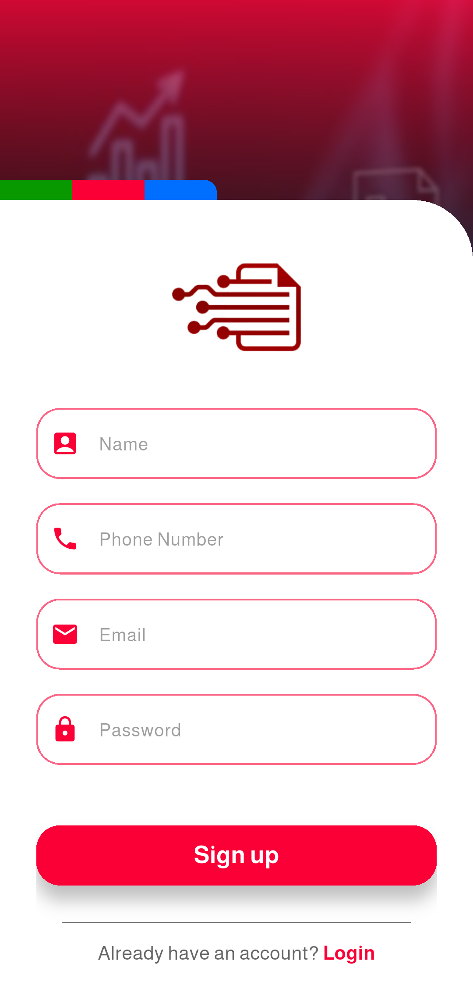

# summarization-system

**Summarization System** is an intelligent Flutter application that helps users extract and summarize content from large PDF files using highlighted text. The app recognizes and differentiates between text colors to determine document structure and generate a clean summary.

---

## 🎯 Objective

To provide students, researchers, and professionals with a smart tool to quickly generate summaries from previously highlighted content inside PDF files.

---

## 🚀 Features

- 📤 Upload PDF files with highlighted text  
- 🎨 Color-based classification (e.g., pink = title, yellow = content)  
- 🖼️ Convert PDF pages to images  
- 🔍 Pixel-level color detection  
- 🧠 OCR (Optical Character Recognition) to extract text from colored regions only  
- 🪄 Reconstruct a structured, summarized output  
- 🗂️ Export or view the result in a clear format

---

## 🛠️ Technologies Used

- **Flutter** for cross-platform app development  
- **syncfusion_flutter_pdfviewer** for PDF rendering  
- **screenshot** for capturing PDF pages as images  
- **Google ML Kit OCR** for text recognition  
- **Image color analysis** for detecting highlighted regions  
- **Provider** or **setState** for state management

---

## 🧪 Workflow Overview

1. 📄 User uploads a PDF file  
2. 🖼️ Pages are converted to images  
3. 🎯 Highlighted areas are detected using RGB thresholds  
4. 🔤 Text is extracted using OCR only from those regions  
5. 📝 Extracted text is ordered top-to-bottom per page  
6. 📑 Displayed as a structured summary (titles + content)

---

## 📱 Screenshots

### Welcome Screen

  

### Sign up Screen

  

### Login Screen

  

### Home Screen

  

### Home Screen (Choose Pdf)

  

### Home Screen (After Extracting Text)

  

---

## 🎬 Demo

  

---

## 🧑‍💻 Author

**Mohamed Mohamed Barakat**
